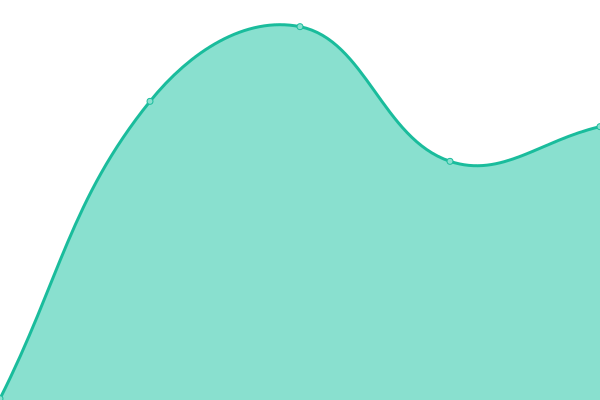

# [📈 Live Status](https://cds-snc.github.io/status-statut): <!--live status--> **🟧 Partial outage**

This repository contains the open-source uptime monitor and status page for [Canadian Digital Service – Service numérique canadien](https://digital.canada.ca), powered by [Upptime](https://github.com/upptime/upptime).

[](https://github.com/cds-snc/status-statut/actions?query=workflow%3A%22Uptime+CI%22)
[](https://github.com/cds-snc/status-statut/actions?query=workflow%3A%22Response+Time+CI%22)
[](https://github.com/cds-snc/status-statut/actions?query=workflow%3A%22Graphs+CI%22)
[](https://github.com/cds-snc/status-statut/actions?query=workflow%3A%22Static+Site+CI%22)
[](https://github.com/cds-snc/status-statut/actions?query=workflow%3A%22Summary+CI%22)

With [Upptime](https://upptime.js.org), you can get your own unlimited and free uptime monitor and status page, powered entirely by a GitHub repository. We use [Issues](https://github.com/cds-snc/status-statut/issues) as incident reports, [Actions](https://github.com/cds-snc/status-statut/actions) as uptime monitors, and [Pages](https://cds-snc.github.io/status-statut) for the status page.

<!--start: status pages-->
<!-- This summary is generated by Upptime (https://github.com/upptime/upptime) -->
<!-- Do not edit this manually, your changes will be overwritten -->
<!-- prettier-ignore -->
| URL | Status | History | Response Time | Uptime |
| --- | ------ | ------- | ------------- | ------ |
|  [digital.canada.ca](https://digital.canada.ca/) | Up / Opérationnel | [digital-canada-ca.yml](https://github.com/cds-snc/status-statut/commits/HEAD/history/digital-canada-ca.yml) | <details><summary> 134ms</summary><br><a href="https://status-statut.cds-snc.ca/history/digital-canada-ca"></a><br><a href="https://status-statut.cds-snc.ca/history/digital-canada-ca"></a><br><a href="https://status-statut.cds-snc.ca/history/digital-canada-ca"></a><br><a href="https://status-statut.cds-snc.ca/history/digital-canada-ca"></a><br><a href="https://status-statut.cds-snc.ca/history/digital-canada-ca"></a></details> | <details><summary><a href="https://status-statut.cds-snc.ca/history/digital-canada-ca">100.00%</a></summary><a href="https://status-statut.cds-snc.ca/history/digital-canada-ca"></a><br><a href="https://status-statut.cds-snc.ca/history/digital-canada-ca"></a><br><a href="https://status-statut.cds-snc.ca/history/digital-canada-ca"></a><br><a href="https://status-statut.cds-snc.ca/history/digital-canada-ca"></a><br><a href="https://status-statut.cds-snc.ca/history/digital-canada-ca"></a></details>
|  [numerique.canada.ca](https://numerique.canada.ca/) | Up / Opérationnel | [numerique-canada-ca.yml](https://github.com/cds-snc/status-statut/commits/HEAD/history/numerique-canada-ca.yml) | <details><summary> 107ms</summary><br><a href="https://status-statut.cds-snc.ca/history/numerique-canada-ca"></a><br><a href="https://status-statut.cds-snc.ca/history/numerique-canada-ca"></a><br><a href="https://status-statut.cds-snc.ca/history/numerique-canada-ca"></a><br><a href="https://status-statut.cds-snc.ca/history/numerique-canada-ca"></a><br><a href="https://status-statut.cds-snc.ca/history/numerique-canada-ca"></a></details> | <details><summary><a href="https://status-statut.cds-snc.ca/history/numerique-canada-ca">100.00%</a></summary><a href="https://status-statut.cds-snc.ca/history/numerique-canada-ca"></a><br><a href="https://status-statut.cds-snc.ca/history/numerique-canada-ca"></a><br><a href="https://status-statut.cds-snc.ca/history/numerique-canada-ca"></a><br><a href="https://status-statut.cds-snc.ca/history/numerique-canada-ca"></a><br><a href="https://status-statut.cds-snc.ca/history/numerique-canada-ca"></a></details>
|  [GC Articles - Articles GC](https://articles.alpha.canada.ca/sign-in-se-connecter/) | Up / Opérationnel | [gc-articles-articles-gc.yml](https://github.com/cds-snc/status-statut/commits/HEAD/history/gc-articles-articles-gc.yml) | <details><summary> 632ms</summary><br><a href="https://status-statut.cds-snc.ca/history/gc-articles-articles-gc"></a><br><a href="https://status-statut.cds-snc.ca/history/gc-articles-articles-gc"></a><br><a href="https://status-statut.cds-snc.ca/history/gc-articles-articles-gc"></a><br><a href="https://status-statut.cds-snc.ca/history/gc-articles-articles-gc"></a><br><a href="https://status-statut.cds-snc.ca/history/gc-articles-articles-gc"></a></details> | <details><summary><a href="https://status-statut.cds-snc.ca/history/gc-articles-articles-gc">100.00%</a></summary><a href="https://status-statut.cds-snc.ca/history/gc-articles-articles-gc"></a><br><a href="https://status-statut.cds-snc.ca/history/gc-articles-articles-gc"></a><br><a href="https://status-statut.cds-snc.ca/history/gc-articles-articles-gc"></a><br><a href="https://status-statut.cds-snc.ca/history/gc-articles-articles-gc"></a><br><a href="https://status-statut.cds-snc.ca/history/gc-articles-articles-gc"></a></details>
|  [GC Forms - Formulaires GC](https://forms-formulaires.alpha.canada.ca/) | Up / Opérationnel | [gc-forms-formulaires-gc.yml](https://github.com/cds-snc/status-statut/commits/HEAD/history/gc-forms-formulaires-gc.yml) | <details><summary> 298ms</summary><br><a href="https://status-statut.cds-snc.ca/history/gc-forms-formulaires-gc"></a><br><a href="https://status-statut.cds-snc.ca/history/gc-forms-formulaires-gc"></a><br><a href="https://status-statut.cds-snc.ca/history/gc-forms-formulaires-gc"></a><br><a href="https://status-statut.cds-snc.ca/history/gc-forms-formulaires-gc"></a><br><a href="https://status-statut.cds-snc.ca/history/gc-forms-formulaires-gc"></a></details> | <details><summary><a href="https://status-statut.cds-snc.ca/history/gc-forms-formulaires-gc">100.00%</a></summary><a href="https://status-statut.cds-snc.ca/history/gc-forms-formulaires-gc"></a><br><a href="https://status-statut.cds-snc.ca/history/gc-forms-formulaires-gc"></a><br><a href="https://status-statut.cds-snc.ca/history/gc-forms-formulaires-gc"></a><br><a href="https://status-statut.cds-snc.ca/history/gc-forms-formulaires-gc"></a><br><a href="https://status-statut.cds-snc.ca/history/gc-forms-formulaires-gc"></a></details>
|  [GC Notify](https://notification.canada.ca/) | Up / Opérationnel | [gc-notify.yml](https://github.com/cds-snc/status-statut/commits/HEAD/history/gc-notify.yml) | <details><summary> 524ms</summary><br><a href="https://status-statut.cds-snc.ca/history/gc-notify"></a><br><a href="https://status-statut.cds-snc.ca/history/gc-notify"></a><br><a href="https://status-statut.cds-snc.ca/history/gc-notify"></a><br><a href="https://status-statut.cds-snc.ca/history/gc-notify"></a><br><a href="https://status-statut.cds-snc.ca/history/gc-notify"></a></details> | <details><summary><a href="https://status-statut.cds-snc.ca/history/gc-notify">100.00%</a></summary><a href="https://status-statut.cds-snc.ca/history/gc-notify"></a><br><a href="https://status-statut.cds-snc.ca/history/gc-notify"></a><br><a href="https://status-statut.cds-snc.ca/history/gc-notify"></a><br><a href="https://status-statut.cds-snc.ca/history/gc-notify"></a><br><a href="https://status-statut.cds-snc.ca/history/gc-notify"></a></details>
|  [Scan websites](https://scan-websites.alpha.canada.ca/) | Up / Opérationnel | [scan-websites.yml](https://github.com/cds-snc/status-statut/commits/HEAD/history/scan-websites.yml) | <details><summary> 2423ms</summary><br><a href="https://status-statut.cds-snc.ca/history/scan-websites"></a><br><a href="https://status-statut.cds-snc.ca/history/scan-websites"></a><br><a href="https://status-statut.cds-snc.ca/history/scan-websites"></a><br><a href="https://status-statut.cds-snc.ca/history/scan-websites"></a><br><a href="https://status-statut.cds-snc.ca/history/scan-websites"></a></details> | <details><summary><a href="https://status-statut.cds-snc.ca/history/scan-websites">100.00%</a></summary><a href="https://status-statut.cds-snc.ca/history/scan-websites"></a><br><a href="https://status-statut.cds-snc.ca/history/scan-websites"></a><br><a href="https://status-statut.cds-snc.ca/history/scan-websites"></a><br><a href="https://status-statut.cds-snc.ca/history/scan-websites"></a><br><a href="https://status-statut.cds-snc.ca/history/scan-websites"></a></details>
|  [Scan files](https://scan-files.alpha.canada.ca/healthcheck) | Up / Opérationnel | [scan-files.yml](https://github.com/cds-snc/status-statut/commits/HEAD/history/scan-files.yml) | <details><summary> 334ms</summary><br><a href="https://status-statut.cds-snc.ca/history/scan-files"></a><br><a href="https://status-statut.cds-snc.ca/history/scan-files"></a><br><a href="https://status-statut.cds-snc.ca/history/scan-files"></a><br><a href="https://status-statut.cds-snc.ca/history/scan-files"></a><br><a href="https://status-statut.cds-snc.ca/history/scan-files"></a></details> | <details><summary><a href="https://status-statut.cds-snc.ca/history/scan-files">100.00%</a></summary><a href="https://status-statut.cds-snc.ca/history/scan-files"></a><br><a href="https://status-statut.cds-snc.ca/history/scan-files"></a><br><a href="https://status-statut.cds-snc.ca/history/scan-files"></a><br><a href="https://status-statut.cds-snc.ca/history/scan-files"></a><br><a href="https://status-statut.cds-snc.ca/history/scan-files"></a></details>
|  [Share secrets](https://secret.cdssandbox.xyz/) | Down / En panne | [share-secrets.yml](https://github.com/cds-snc/status-statut/commits/HEAD/history/share-secrets.yml) | <details><summary> 516ms</summary><br><a href="https://status-statut.cds-snc.ca/history/share-secrets"></a><br><a href="https://status-statut.cds-snc.ca/history/share-secrets"></a><br><a href="https://status-statut.cds-snc.ca/history/share-secrets"></a><br><a href="https://status-statut.cds-snc.ca/history/share-secrets"></a><br><a href="https://status-statut.cds-snc.ca/history/share-secrets"></a></details> | <details><summary><a href="https://status-statut.cds-snc.ca/history/share-secrets">100.00%</a></summary><a href="https://status-statut.cds-snc.ca/history/share-secrets"></a><br><a href="https://status-statut.cds-snc.ca/history/share-secrets"></a><br><a href="https://status-statut.cds-snc.ca/history/share-secrets"></a><br><a href="https://status-statut.cds-snc.ca/history/share-secrets"></a><br><a href="https://status-statut.cds-snc.ca/history/share-secrets"></a></details>
|  [Share file securely](https://share-files.cdssandbox.xyz/healthcheck) | Up / Opérationnel | [share-file-securely.yml](https://github.com/cds-snc/status-statut/commits/HEAD/history/share-file-securely.yml) | <details><summary> 247ms</summary><br><a href="https://status-statut.cds-snc.ca/history/share-file-securely"></a><br><a href="https://status-statut.cds-snc.ca/history/share-file-securely"></a><br><a href="https://status-statut.cds-snc.ca/history/share-file-securely"></a><br><a href="https://status-statut.cds-snc.ca/history/share-file-securely"></a><br><a href="https://status-statut.cds-snc.ca/history/share-file-securely"></a></details> | <details><summary><a href="https://status-statut.cds-snc.ca/history/share-file-securely">100.00%</a></summary><a href="https://status-statut.cds-snc.ca/history/share-file-securely"></a><br><a href="https://status-statut.cds-snc.ca/history/share-file-securely"></a><br><a href="https://status-statut.cds-snc.ca/history/share-file-securely"></a><br><a href="https://status-statut.cds-snc.ca/history/share-file-securely"></a><br><a href="https://status-statut.cds-snc.ca/history/share-file-securely"></a></details>
|  [SRE Bot](https://sre-bot.cdssandbox.xyz/version) | Up / Opérationnel | [sre-bot.yml](https://github.com/cds-snc/status-statut/commits/HEAD/history/sre-bot.yml) | <details><summary> 267ms</summary><br><a href="https://status-statut.cds-snc.ca/history/sre-bot"></a><br><a href="https://status-statut.cds-snc.ca/history/sre-bot"></a><br><a href="https://status-statut.cds-snc.ca/history/sre-bot"></a><br><a href="https://status-statut.cds-snc.ca/history/sre-bot"></a><br><a href="https://status-statut.cds-snc.ca/history/sre-bot"></a></details> | <details><summary><a href="https://status-statut.cds-snc.ca/history/sre-bot">100.00%</a></summary><a href="https://status-statut.cds-snc.ca/history/sre-bot"></a><br><a href="https://status-statut.cds-snc.ca/history/sre-bot"></a><br><a href="https://status-statut.cds-snc.ca/history/sre-bot"></a><br><a href="https://status-statut.cds-snc.ca/history/sre-bot"></a><br><a href="https://status-statut.cds-snc.ca/history/sre-bot"></a></details>
|  [Learning Resources](https://learning-resources.cdssandbox.xyz/) | Up / Opérationnel | [learning-resources.yml](https://github.com/cds-snc/status-statut/commits/HEAD/history/learning-resources.yml) | <details><summary> 311ms</summary><br><a href="https://status-statut.cds-snc.ca/history/learning-resources"></a><br><a href="https://status-statut.cds-snc.ca/history/learning-resources"></a><br><a href="https://status-statut.cds-snc.ca/history/learning-resources"></a><br><a href="https://status-statut.cds-snc.ca/history/learning-resources"></a><br><a href="https://status-statut.cds-snc.ca/history/learning-resources"></a></details> | <details><summary><a href="https://status-statut.cds-snc.ca/history/learning-resources">100.00%</a></summary><a href="https://status-statut.cds-snc.ca/history/learning-resources"></a><br><a href="https://status-statut.cds-snc.ca/history/learning-resources"></a><br><a href="https://status-statut.cds-snc.ca/history/learning-resources"></a><br><a href="https://status-statut.cds-snc.ca/history/learning-resources"></a><br><a href="https://status-statut.cds-snc.ca/history/learning-resources"></a></details>

<!--end: status pages-->

[**Visit our status website →**](https://cds-snc.github.io/status-statut)

## Onboarding

To add a new site update the `sites` key in [.upptimerc.yml](https://github.com/cds-snc/status-statut/blob/main/.upptimerc.yml#L5) with a new entry:

```yaml
- name: Your site name
  url: https://your-site-url.ca
  assignees:
    - github-username-to-notify
    - another-github-username-to-notify
```

## 📄 License

- Powered by: [Upptime](https://github.com/upptime/upptime)
- Code: [MIT](./LICENSE) © [Canadian Digital Service – Service numérique canadien](https://digital.canada.ca)
- Data in the `./history` directory: [Open Database License](https://opendatacommons.org/licenses/odbl/1-0/)
